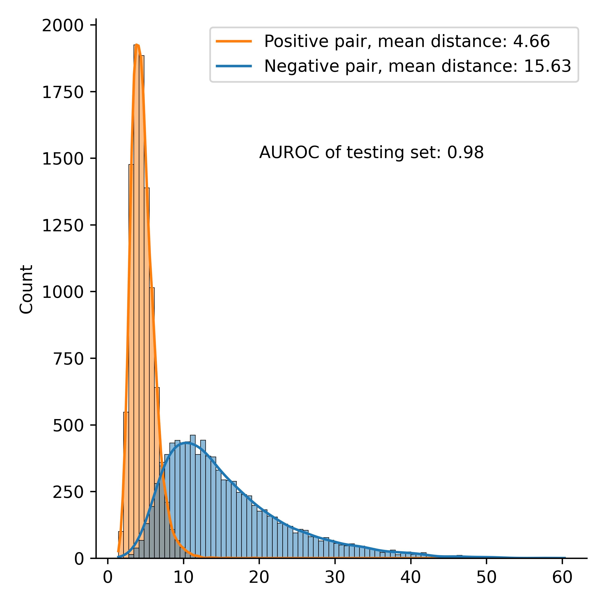

# MaSIF PyTorch implementation

This repo holds codes for masif implementation, temporarily contains MaSIF-search.

How to train the model:
```
python main.py
```

Parameter descriptions are listed `arguments.py`



How to do test:
```
python inference.py --raw_path analysis/pdbs --processed_path analysis/processed --data_list 7YV1_A_I --cache_model experiments/masif_logp/12-21-16-35/model.pth --experiment_name test --prepare_data True
```
Need to specify the raw path, model path and set prepare_data to True.